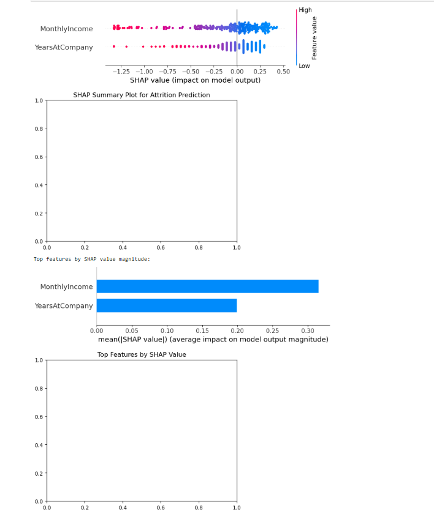

# Elevate-Labs-Internship-Project-HR-Analytics-Predict_Employee_Attrition

# HR Analytics: Predict Employee Attrition

Internship project analyzing causes of employee resignation and building a predictive model.

## Overview
- **Objective**: Use Python for EDA and modeling, Power BI for visualization, and SHAP for explainability.
- **Dataset**: IBM HR Analytics Employee Attrition (from Kaggle).
- **Key Findings**: MonthlyIncome is the top attrition driver (SHAP analysis); model accuracy ~85%.

## Files
- `HR_Analysis.ipynb`: Full Jupyter notebook with EDA, Logistic Regression model, and SHAP plots.
- `hr_attrition_prepared.csv`: Prepared dataset.
- `Internship_Project_HR_Attrition_Dashboard.pbix`: Interactive Power BI dashboard (bar/line charts for attrition factors).
- `HR_Attrition_Report.pdf`: 1-2 page summary report.
- `accuracy_report.txt`: Model accuracy and confusion matrix.

## Setup & Run
1. Clone repo: `git clone https://github.com/yourusername/HR-Employee-Attrition-Prediction.git`
2. Install dependencies: `pip install pandas seaborn scikit-learn shap`
3. Open `HR_Analysis.ipynb` in Jupyter: Run all cells.
4. Open .pbix in Power BI Desktop.

## Screenshots

